# RouteCodex Hooks Full Lifecycle Flowchart

This diagram covers the full lifecycle from installation through live delivery
and closure. It intentionally includes failure, recovery, and authorization
gates so a green path never overstates evidence.

```mermaid
flowchart TD
  subgraph S0["Bootstrap / Install"]
    A["Latest main + clean worktree"] --> B["npm run check + npm test + plugin validator"]
    B --> C["clean host npm run init"]
    C --> D{"install record valid?\n hooks.json + rccv3-codexapp + wrappers"}
    D -- no --> FAIL1["FAIL: preserve exact error; do not start"]
    D -- yes --> E["register TUI/Desktop targets"]
    E --> F{"target sockets exist?\n TUI App Server / Desktop App Server"}
    F -- no --> FAIL1
  end

  subgraph S1["Process Lifecycle"]
    F -- yes --> G["Supervisor start"]
    G --> H["Start codexapp"]
    H --> I{"capabilities ready?\n session_status + send_message_to_thread"}
    I -- no --> FAIL2["FAIL: hooksd not ready; RouteCodex main must survive"]
    I -- yes --> J["Start hooksd"]
    J --> K{"daemon /health ready?"}
    K -- no --> FAIL2
    K -- yes --> READY["READY"]
  end

  subgraph S2["Event Lifecycle"]
    READY --> L["Official Hook stdin"]
    L --> M{"valid JSON + supported event?"}
    M -- no --> E1["FAIL: nonzero hook, no mutation"]
    M -- yes --> N["hook-entry strips intent envelope"]
    N --> O{"stop event + stop_hook_active?"}
    O -- yes --> P["GUARDED: no intent"]
    O -- no --> Q{"policy / operator returns intent?"}
    Q -- no --> R["OBSERVED: normal no-op"]
    Q -- yes --> S["daemon dispatch"]
    S --> T{"idempotent or expired?"}
    T -- yes --> U["return existing / expired"]
    T -- no --> V["session_status(target)"]
    V --> V1{"status readable?"}
    V1 -- no --> F1["FAIL_CLOSED: unknown / disconnected / unsupported"]
    V1 -- yes --> W{"state + send_mode gate"}
    W -- "working + idle_only\ninput_active\nstopping" --> X["DEFERRED persisted"]
    W -- "idle or working_allowed" --> Y["codexapp.send_message"]
    Y --> Y1{"native accepted?"}
    Y1 -- no --> F2["FAILED: preserve exact native error"]
    Y1 -- timeout/uncertain --> U1["UNKNOWN_DELIVERY: no blind retry"]
    Y1 -- yes --> Z["delivery ledger"]
    Z --> Z1{"target receipt / execution / reply / read?"}
    Z1 -- missing --> F3["UNRESOLVED: do not claim success"]
    Z1 -- yes --> Z2["READ / ACK"]
  end

  subgraph S3["Closure"]
    Z2 --> AA{"acceptance matrix complete?"}
    AA -- no --> AB["record gap + rerun missing live trace"]
    AA -- yes --> AC["review PASS"]
    AC --> AD{"user authorized push / merge / restart?"}
    AD -- no --> AE["keep candidate + handoff evidence"]
    AD -- yes --> AF["push / merge / restart"]
    AF --> AG{"same-entry live replay still passes?"}
    AG -- no --> AH["fix root cause; repeat lifecycle"]
    AG -- yes --> AI["CLOSED"]
  end

  subgraph S4["Accident Recovery"]
    FAIL1 --> X1["Stop ordered gates; keep error; no fake ready"]
    FAIL2 --> X1
    E1 --> X1
    F1 --> X1
    F2 --> X1
    U1 --> X1
    F3 --> X1
    X1 --> X2{"restart / recover?"}
    X2 -- no --> X3["escalate with exact evidence"]
    X2 -- yes --> X4["recoverOutbox: emitted/sending stay unresolved"]
    X4 --> X5{"target known + status readable?"}
    X5 -- no --> X3
    X5 -- yes --> X6["flush deferred / resume once"]
    X6 --> X7["continue event lifecycle / repeat trace"]
    X7 --> S2
  end
```

## Accidental states that must stay explicit

| Accident / edge | Expected handling |
| --- | --- |
| Install/validator failure | Block startup; keep exact command and error. |
| `rccv3-codexapp` missing or stale | Supervisor fails closed; no fake readiness. |
| TUI/Desktop App Server socket missing | Target registration/status fails with exact scope/transport error. |
| `hooksd` not ready | Hook entry exits nonzero; RouteCodex main service must not be taken down. |
| Malformed hook stdin | Nonzero hook, no daemon mutation. |
| `stop_hook_active=true` | Guarded, no Stopless intent. |
| Unknown/disconnected session | Fail closed; never send. |
| Working + `idle_only` / input active | Defer and persist; flush later only when safe. |
| Native send timeout/uncertain | `unknown_delivery`; no blind retry, no success claim. |
| Accepted but no receipt/execution/reply/read | Delivery ledger stays unresolved. |
| Duplicate event/intent | Idempotent existing result; no duplicate send. |
| Daemon restart | Recover outbox; unresolved in-flight sends are not silently replayed as success. |
| CodexApp crash/disconnect | Exact native error; restart path only after root cause is clear. |
| Stale installed source | Re-run `npm run init`; verify installed copy matches merged HEAD. |
| Merge/push/restart not authorized | Candidate stays local; evidence handoff only. |
