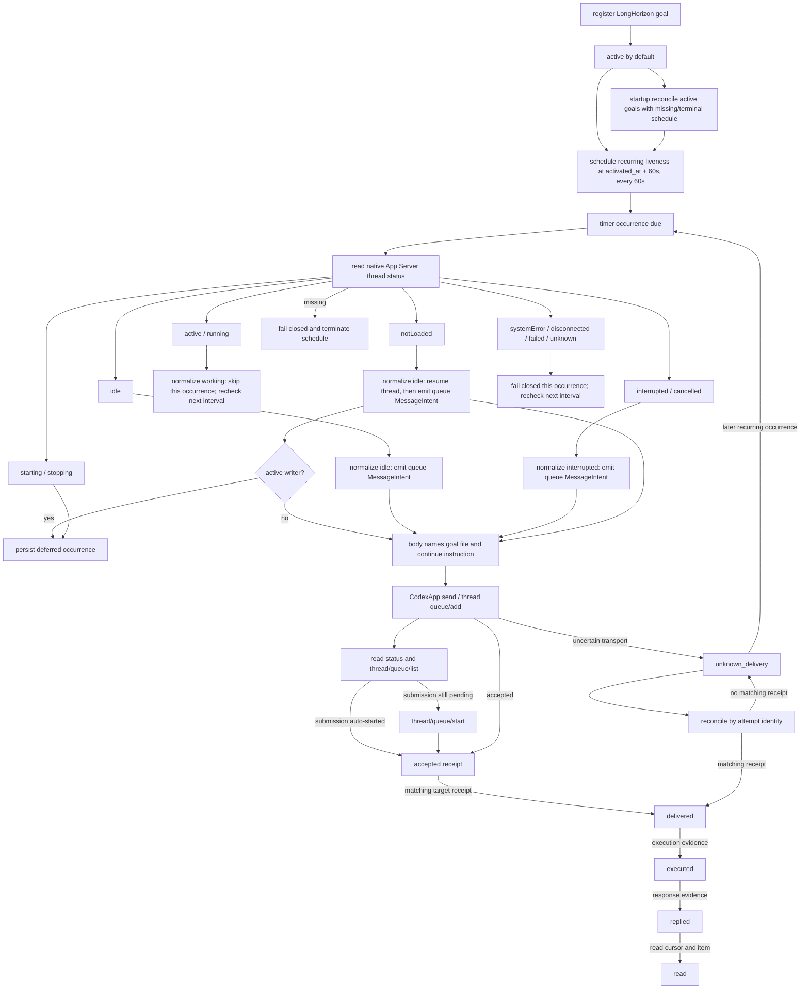

# RCCS Notification Liveness DAG

Status: implemented contract.

This document is the human review surface for LongHorizon goal liveness and
the shared notification gate. The machine-readable source is
[`contracts/rccs-notification-dag.json`](../../contracts/rccs-notification-dag.json).
The executable owners are [`src/control.js`](../../src/control.js),
[`src/timer.js`](../../src/timer.js), and [`src/daemon.js`](../../src/daemon.js).

## Scope

Registering a LongHorizon goal record activates it immediately. The control
plane creates a recurring liveness schedule due 60 seconds after activation.
On daemon startup, every active goal without a live liveness schedule is
reconciled and receives a recurring schedule due 60 seconds from startup.
The schedule uses `idle_only`, `busy_policy=skip`, source `longhorizon`, and a
60-second interval. A busy occurrence is skipped without creating a backlog;
the next interval checks again. The wake body names the goal file and tells the
target to continue executing the goal.

The App Server `turn/steer` operation is only valid for a live active turn.
LongHorizon liveness is not a same-turn correction: native `active` and
`running` targets normalize to `working` and are skipped, while native `idle`,
`interrupted`/`cancelled`, and `notLoaded` targets normalize to send-eligible
states and receive a `thread/queue/add` wake. `notLoaded` is resumed before the
queue add. When a queued submission remains pending after the add, CodexApp
starts it explicitly with `thread/queue/start`. The liveness path never steers.
If `thread/resume` is blocked by an existing active writer, CodexApp reports a
definitive `native_thread_busy` result. The occurrence remains deferred and is
retried on a later liveness tick; it is not classified as uncertain delivery.

The same DAG also defines what happens after a wake is emitted. Native
acceptance is only one receipt state; delivery, execution, reply, and read are
separate evidence transitions. An uncertain transport result enters
reconciliation and is never blindly retried with the same attempt identity.

## DAG



## Edge contract

| Edge | Owner | Input | Output / state | Failure evidence |
| --- | --- | --- | --- | --- |
| Register goal → active | `policy.longhorizon` | goal id, goal file, session alias | active record with `activated_at` | missing goal file or session binding |
| Active → liveness schedule | `policy.longhorizon` | activation timestamp | recurring schedule due in 60s, interval 60s | schedule persistence error |
| Active → startup reconcile | `policy.longhorizon` | active goal records + schedules | missing or terminal liveness schedule rebuilt; next check due in 60s | missing goal file or session binding |
| Due → native status observation | `policy.timer` → `codexapp` | target identity | native thread state | status error maps to explicit failure |
| Active/running → working | `codexapp` | native `active` or `running` | normalized `working` | native state is not treated as a direct policy state |
| Idle/interrupted/cancelled → eligible | `codexapp` | native `idle`, `interrupted`, or `cancelled` | normalized send-eligible state | native state is not treated as a direct policy state |
| Not loaded → resume + idle | `codexapp` | native `notLoaded` | `thread/resume`, then normalized `idle` | no queue add before resume |
| Resume → active writer deferred | `codexapp` → `hooksd` | `thread/resume` returns active writer | definitive `native_thread_busy`; occurrence stays deferred | no `unknown_delivery`, queue add, or steer |
| Starting/stopping → deferred | `codexapp` | native `starting` or `stopping` | normalized deferred state | no blind send |
| System error → failed | `codexapp` | native `systemError` | normalized `failed` | no blind send |
| Unknown/disconnected/failed → fail closed | `codexapp` | native `unknown`, `disconnected`, or `failed` | normalized fail-closed state | no blind send |
| Working → skip | `hooksd` | `working` observation + `skip` | current occurrence `skipped`; next interval remains scheduled | native send or steer would be a contract failure |
| Idle/interrupted → queue | `hooksd` | legal send state | `MessageIntent.operation=queue` with goal continuation body | no steer operation is allowed |
| Starting/stopping → deferred | `hooksd` | normalized transition state | persisted pending occurrence | no blind send |
| Unknown/disconnected/failed → fail closed | `hooksd` | non-authoritative state | current occurrence failure; next interval remains scheduled | error retained on the schedule |
| Missing/dead → fail closed | `hooksd` | missing target | terminal `session_missing`, no send | error retained on the schedule |
| Queue → accepted | `codexapp` | target, body, attempt id | native `thread/queue/add` receipt | transport error remains explicit |
| Accepted → queue observed | `codexapp` | queued submission identity | native status plus `thread/queue/list` | queue identity is preserved |
| Pending → started | `codexapp` | queued submission still present | native `thread/queue/start` receipt | active/pending race is treated as already started; other errors remain explicit |
| Accepted → delivered | `hooksd.transport` | matching target receipt | delivered evidence | acceptance alone is insufficient |
| Delivered → executed → replied → read | `hooksd.transport` | matching item, turn, cursor | ordered evidence states | missing evidence leaves state unresolved |
| Queue → unknown delivery | `hooksd.transport` | timeout or uncertain transport | `unknown_delivery` | no blind retry |
| Unknown → reconcile | `hooksd.transport` | same attempt identity | matching evidence or unresolved | mismatched receipt is rejected |

## Invariants

1. A newly registered LongHorizon goal is active by default.
2. The first liveness check is scheduled 60 seconds after activation.
2a. Daemon startup reconciles every active goal that has no live liveness
    schedule and schedules its next check 60 seconds from reconciliation.
3. App Server `active` and `running` normalize to `working`; liveness skips the
   current occurrence and checks again at the next interval without steering.
4. App Server `idle`, `interrupted`, and `cancelled` normalize to send-eligible
   states; idle and interrupted receive a queue wake. Liveness never steers.
5. App Server `starting` and `stopping` normalize to deferred states.
6. App Server `systemError` normalizes to `failed`; `disconnected`, `failed`,
   and `unknown` fail closed without a queue wake.
7. App Server `notLoaded` normalizes to `idle`, resumes the thread, then queues
   the wake.
8. A queued submission that remains pending after `thread/queue/add` is
   explicitly started with `thread/queue/start`.
9. An active writer during `thread/resume` keeps the occurrence deferred for a
   later retry; it is not uncertain delivery and does not queue or steer.
10. The queue wake body names the goal file and instructs the target to continue
   executing the goal.
11. Starting and stopping are deferred until a legal observation.
12. Unknown, disconnected, and failed targets fail closed for the current
   occurrence and are checked again; missing and dead targets terminate the
   schedule.
13. Accepted, queued, delivered, executed, replied, and read are distinct
   evidence states.
14. An uncertain delivery is reconciled by the same attempt identity and is
   never blindly retried. A later recurring occurrence still continues probing;
   an unresolved old attempt must not permanently disable the liveness schedule.

## Evidence mapping

| Contract edge | Executable evidence |
| --- | --- |
| First liveness check | `test/longhorizon-liveness.test.js`: waits 60 seconds before the first wake |
| Startup reconciliation | `test/longhorizon-liveness.test.js`: reconciles active goals with missing or terminal schedules |
| Idle queue wake | `test/longhorizon-liveness.test.js`: wakes an idle target through queue |
| Working/active/running skip | `test/longhorizon-liveness.test.js`: skips a working target without queueing and keeps probing until idle |
| Idle/interrupted queue wake | `test/longhorizon-liveness.test.js`: wakes an idle and interrupted target through queue; applies the active idle interrupted state matrix through queue wake |
| Native status normalization | `test/codexapp-entry.test.js`: maps every native thread status through the control socket |
| Not loaded resume and interrupted queue start | `test/codexapp-entry.test.js`: applies every native status through the native bridge |
| Active writer resume deferral | `test/codexapp-entry.test.js`: reports an active writer during notLoaded resume as definitive; `test/longhorizon-liveness.test.js`: defers an active-writer resume and retries after release |
| Starting/stopping defer | `test/longhorizon-liveness.test.js`: defers while starting or stopping |
| Fail closed | `test/longhorizon-liveness.test.js`: fails closed for unknown disconnected failed |
| Missing session | `test/longhorizon-liveness.test.js`: records a missing session as terminal |
| Queue-only delivery | `test/longhorizon-liveness.test.js`: uses queue and never steers |
| Evidence progression | `test/longhorizon-liveness.test.js`: accepted evidence is not promoted to executed |
| Uncertain reconciliation | `test/longhorizon-liveness.test.js`: uncertain delivery reconciles without blind retry |
## Verification

The feature is closed only when all of the following hold:

```sh
npm run check
npm test
```

Expected result: zero exit status, all Node tests passing, and the contract
test validating the notification DAG nodes, edges, resources, and test
bindings.
