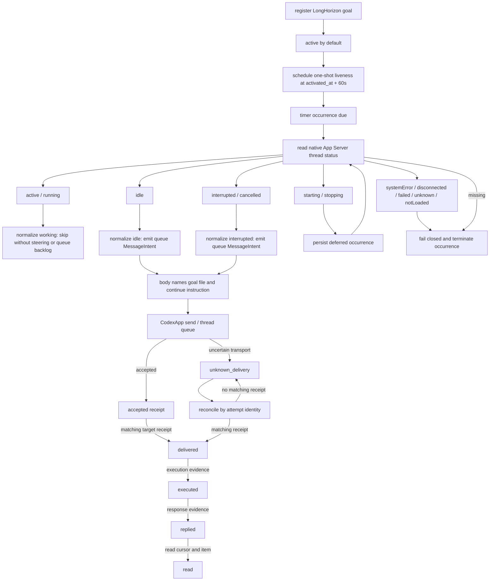

# RCCS Notification Liveness DAG

Status: implemented contract.

This document is the human review surface for LongHorizon goal liveness and
the shared notification gate. The machine-readable source is
[`contracts/rccs-notification-dag.json`](../../contracts/rccs-notification-dag.json).
The executable owners are [`src/control.js`](../../src/control.js),
[`src/timer.js`](../../src/timer.js), and [`src/daemon.js`](../../src/daemon.js).

## Scope

Registering a LongHorizon goal record activates it immediately. The control
plane creates one one-shot liveness schedule due 60 seconds after activation.
The schedule uses `idle_only`, `busy_policy=skip`, and source `longhorizon`.
The wake body names the goal file and tells the target to continue executing
the goal.

The App Server `turn/steer` operation is only valid for a live active turn.
LongHorizon liveness is not a same-turn correction: native `active` and
`running` targets normalize to `working` and are skipped, while native `idle`
and `interrupted`/`cancelled` targets normalize to send-eligible states and
receive a `thread/queue/add` wake. The liveness path never steers.

The same DAG also defines what happens after a wake is emitted. Native
acceptance is only one receipt state; delivery, execution, reply, and read are
separate evidence transitions. An uncertain transport result enters
reconciliation and is never blindly retried with the same attempt identity.

## DAG



## Edge contract

| Edge | Owner | Input | Output / state | Failure evidence |
| --- | --- | --- | --- | --- |
| Register goal → active | `policy.longhorizon` | goal id, goal file, session alias | active record with `activated_at` | missing goal file or session binding |
| Active → liveness schedule | `policy.longhorizon` | activation timestamp | one-shot schedule due in 60s | schedule persistence error |
| Due → native status observation | `policy.timer` → `codexapp` | target identity | native thread state | status error maps to explicit failure |
| Active/running → working | `codexapp` | native `active` or `running` | normalized `working` | native state is not treated as a direct policy state |
| Idle/interrupted/cancelled → eligible | `codexapp` | native `idle`, `interrupted`, or `cancelled` | normalized send-eligible state | native state is not treated as a direct policy state |
| Starting/stopping → deferred | `codexapp` | native `starting` or `stopping` | normalized deferred state | no blind send |
| System error → failed | `codexapp` | native `systemError` | normalized `failed` | no blind send |
| Unknown/disconnected/notLoaded → fail closed | `codexapp` | native `unknown`, `disconnected`, `failed`, or `notLoaded` | normalized fail-closed state | no blind send |
| Working → skip | `hooksd` | `working` observation + `skip` | terminal `skipped`, no queue backlog | native send or steer would be a contract failure |
| Idle/interrupted → queue | `hooksd` | legal send state | `MessageIntent.operation=queue` with goal continuation body | no steer operation is allowed |
| Starting/stopping → deferred | `hooksd` | normalized transition state | persisted pending occurrence | no blind send |
| Unknown/disconnected/failed/missing → fail closed | `hooksd` | non-authoritative state | terminal failure, no send | error retained on the schedule |
| Queue → accepted | `codexapp` | target, body, attempt id | native accepted receipt | transport error remains explicit |
| Accepted → delivered | `hooksd.transport` | matching target receipt | delivered evidence | acceptance alone is insufficient |
| Delivered → executed → replied → read | `hooksd.transport` | matching item, turn, cursor | ordered evidence states | missing evidence leaves state unresolved |
| Queue → unknown delivery | `hooksd.transport` | timeout or uncertain transport | `unknown_delivery` | no blind retry |
| Unknown → reconcile | `hooksd.transport` | same attempt identity | matching evidence or unresolved | mismatched receipt is rejected |

## Invariants

1. A newly registered LongHorizon goal is active by default.
2. The first liveness check is scheduled 60 seconds after activation.
3. App Server `active` and `running` normalize to `working`; liveness skips them
   without creating a queue backlog or steering.
4. App Server `idle`, `interrupted`, and `cancelled` normalize to send-eligible
   states; idle and interrupted receive a queue wake. Liveness never steers.
5. App Server `starting` and `stopping` normalize to deferred states.
6. App Server `systemError` normalizes to `failed`; `disconnected`, `failed`,
   `unknown`, and `notLoaded` fail closed without a queue wake.
7. The queue wake body names the goal file and instructs the target to continue
   executing the goal.
8. Starting and stopping are deferred until a legal observation.
9. Unknown, disconnected, failed, missing, and dead targets fail closed.
10. Accepted, queued, delivered, executed, replied, and read are distinct
   evidence states.
11. An uncertain delivery is reconciled by the same attempt identity and is
   never blindly retried.

## Evidence mapping

| Contract edge | Executable evidence |
| --- | --- |
| First liveness check | `test/longhorizon-liveness.test.js`: waits 60 seconds before the first wake |
| Idle queue wake | `test/longhorizon-liveness.test.js`: wakes an idle target through queue |
| Working/active/running skip | `test/longhorizon-liveness.test.js`: skips a working target without queueing; applies the active idle interrupted state matrix through queue wake |
| Idle/interrupted queue wake | `test/longhorizon-liveness.test.js`: wakes an idle and interrupted target through queue; applies the active idle interrupted state matrix through queue wake |
| Native status normalization | `test/codexapp-entry.test.js`: maps every native thread status through the control socket |
| Starting/stopping defer | `test/longhorizon-liveness.test.js`: defers while starting or stopping |
| Fail closed | `test/longhorizon-liveness.test.js`: fails closed for unknown disconnected failed |
| Missing session | `test/longhorizon-liveness.test.js`: records a missing session as terminal |
| Queue-only delivery | `test/longhorizon-liveness.test.js`: uses queue and never steers |
| Evidence progression | `test/longhorizon-liveness.test.js`: accepted evidence is not promoted to executed |
| Uncertain reconciliation | `test/longhorizon-liveness.test.js`: uncertain delivery reconciles without blind retry |
| Native status mapping | `test/codexapp-entry.test.js`: maps live and interrupted native status through the control socket |

## Verification

The feature is closed only when all of the following hold:

```sh
npm run check
npm test
```

Expected result: zero exit status, all Node tests passing, and the contract
test validating the notification DAG nodes, edges, resources, and test
bindings.
