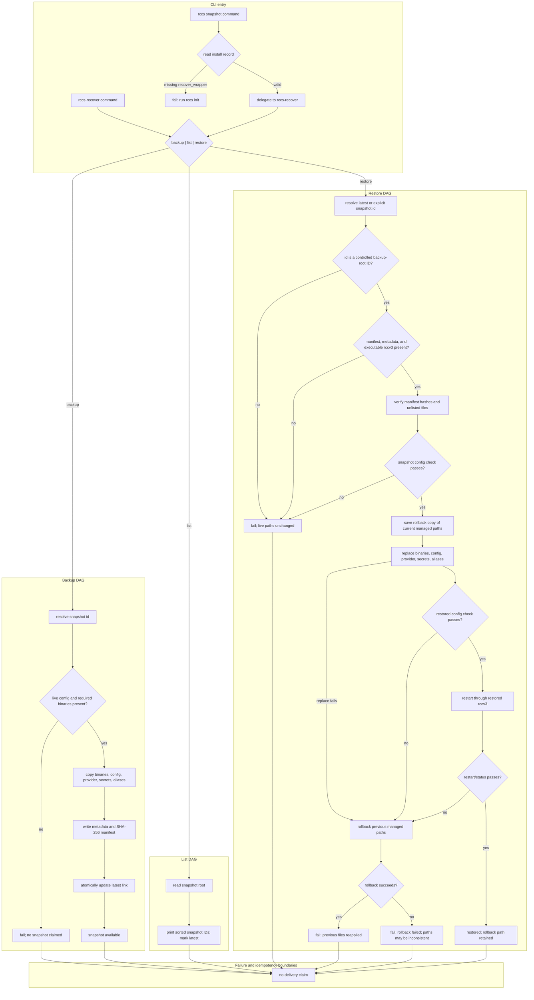

# RCCS Snapshot Recovery DAG

Status: implemented contract.

This document is the human review surface for the standalone snapshot recovery
feature. The machine-readable source is
[`contracts/snapshot-recovery-dag.json`](../../contracts/snapshot-recovery-dag.json).
The executable owner is [`src/rccs-recover.sh`](../../src/rccs-recover.sh).

## Scope

The recovery feature protects the installed RouteCodex control surface:

- `rccv3`, `rccv3-admin`, `rccv3-hooksd`, and `rccv3-codexapp`;
- `config.toml`;
- `provider/` and `secrets/`;
- the `rcc` and `routecodex` aliases.

It provides three operations:

| Operation | Purpose | Mutation boundary |
| --- | --- | --- |
| `backup [--id <snapshot-id>]` | Capture a verified snapshot and update `latest`. | Snapshot root only. |
| `list` | List snapshot IDs and mark the latest snapshot. | Read-only. |
| `restore [latest|<snapshot-id>]` | Validate, replace managed paths, restart, and verify. | Managed live paths only. |

`rccs snapshot backup|list|restore` is a wrapper around the installed
`rccs-recover` executable. The standalone executable does not require Node,
`rccs`, the daemon, or `rccv3` to start. A restore uses the snapshot's own
`rccv3` for the final config check and lifecycle commands.

## DAG



## Edge contract

| Edge | Owner | Input | Output / state | Failure evidence |
| --- | --- | --- | --- | --- |
| `rccs snapshot` → `rccs-recover` | `rccs` CLI | install record `recover_wrapper` | delegated command | missing wrapper; explicit `run rccs init` error |
| CLI → backup validation | `rccs-recover` | live config/binaries | validated source set | required path missing; no snapshot |
| Backup validation → snapshot | `rccs-recover` | source paths | copied `bin`, `config`, `aliases` | copy failure; incomplete snapshot not claimed |
| Snapshot → manifest | `rccs-recover` | copied files | SHA-256 manifest + metadata | hash/write failure |
| Manifest → latest | `rccs-recover` | complete snapshot | `latest` symlink | no link update on failure |
| Restore → ID resolution | `rccs-recover` | `latest` or ID | controlled backup-root directory | invalid ID; no live mutation |
| ID resolution → integrity | `rccs-recover` | snapshot directory | verified manifest and listed file set | tampered/unlisted file; no live mutation |
| Integrity → config gate | snapshot `rccv3` | snapshot config | config check pass | snapshot rejected before rollback save |
| Config gate → rollback save | `rccs-recover` | live managed paths | rollback snapshot | live paths unchanged if save fails |
| Rollback save → live replacement | `rccs-recover` | snapshot + rollback | managed paths replaced | replacement failure restores previous paths |
| Live replacement → validation | restored `rccv3` | live config | config check result | rollback previous paths |
| Validation → restart | restored `rccv3` | live config | restart/status result | rollback previous paths |
| Rollback → result | `rccs-recover` | rollback snapshot | previous state restored or explicit failure | never claim restoration when rollback fails |
| Any terminal path → list/read | `rccs-recover` | snapshot root | list output | no state mutation |

## Invariants

1. Snapshot IDs are basenames under the configured backup root. Absolute
   paths and `..` are rejected.
2. A snapshot is not advertised as `latest` until its manifest and metadata
   are written.
3. A restore never executes a binary from an arbitrary caller-supplied path.
   It executes `rccv3` from the verified snapshot directory.
4. A failed integrity check or snapshot config check occurs before live
   mutation.
5. A rollback is exact: paths absent before restore are removed again, and
   paths present before restore are reapplied.
6. A rollback failure is reported as a rollback failure. The command does not
   claim that previous files were reapplied.
7. Snapshot and rollback roots are separate resources. Restore never mutates
   the source snapshot.
8. `list` is read-only and does not resolve or execute a snapshot binary.
9. The standalone entry has no Node, daemon, or `rccs` dependency.

## Evidence mapping

| Contract edge | Executable evidence |
| --- | --- |
| Backup completeness | `test/snapshot-recover.test.js`: backs up binaries, config, provider, secrets, and aliases |
| List latest marker | `test/snapshot-recover.test.js`: lists snapshots with a latest marker |
| Restore lifecycle | `test/snapshot-recover.test.js`: restores files and invokes only managed lifecycle commands |
| Integrity rejection | `test/snapshot-recover.test.js`: tampered snapshot and unlisted file |
| Snapshot completeness | `test/snapshot-recover.test.js`: refuses an incomplete snapshot |
| ID confinement | `test/snapshot-recover.test.js`: rejects a path outside the backup root |
| Config precheck | `test/snapshot-recover.test.js`: rejects a snapshot whose config check fails |
| Exact rollback | `test/snapshot-recover.test.js`: removes paths absent before restore |
| Rollback failure truth | `test/snapshot-recover.test.js`: reports rollback failure instead of claiming restoration |
| Standalone boundary | `test/snapshot-recover.test.js`: does not require Node on `PATH` |
| CLI help | `test/cli-help.test.js`: `rccs snapshot` help includes `rccs-recover` and `config.toml` |
| CLI delegation | `test/init.test.js`: installed `recover_wrapper` is executable and contains `RCCS_SNAPSHOT_ROOT` |

## Verification

The feature is closed only when all of the following hold:

```sh
sh -n src/rccs-recover.sh
npm run check
npm test
```

Expected result: zero exit status, all Node tests passing, and the recovery
contract test validating the DAG nodes, edges, resources, and test bindings.
The source tests use isolated temporary homes; live restore is not part of
ordinary verification because it mutates the installed runtime.
