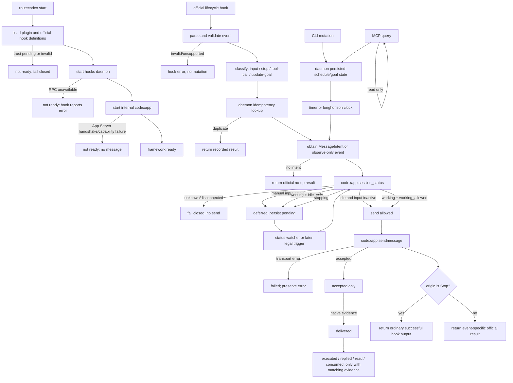
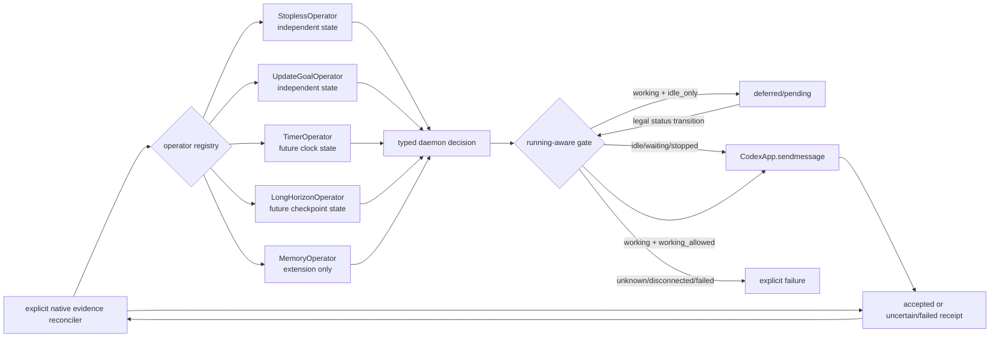

# RouteCodex Hooks Framework Graph

This is a capability skeleton. It defines the graph and evidence boundaries;
it does not enable Stopless, scheduling, memory, or goal mutation policy.

## Invariants

1. Skills contain static facts and methods.
2. MCP reads daemon state; it never advances state.
3. CLI performs authorized mutations; the result is re-read through MCP.
4. Official hooks are adapters only.
5. The daemon owns policy state, idempotency, persistence, status gating, and
   delivery decisions.
6. `codexapp` owns Codex TUI/Desktop App Server communication and status
   observation. It is planned as an independent internal binary in the
   RouteCodex distribution, not a provider protocol feature; this skeleton
   supplies only its typed port boundary.
7. `codexapp.sendmessage` is the only wake action.
8. Every message intent declares one of:
   `idle_only` (do not disturb a working object) or `working_allowed`.
9. A native queue acceptance is not proof of delivery, execution, reply, read,
   or consumption. Those are separate evidence states.
10. Stopless and update-goal have separate hook kinds and separate policy
    state. They share only the transport/status gate.

## Evidence status

The graph is intentionally split into three evidence classes:

- **Implemented baseline**: event normalization, hook-kind routing, status and
  input gating, idempotency, JSON persistence, outbox recovery, external Stop
  output, deterministic timer skeleton, operator-slot query, and exact delivery
  evidence progression.
- **Contract-only**: Stopless, update-goal policy decisions, long-horizon,
  memory, native Stop continuation, and recurring scheduling policy. Their
  slots and boundaries exist, but no business operator is enabled.
- **Real-runtime pending**: CodexApp TUI/Desktop App Server handshake, native
  delivery/read/consumption receipts, plugin trust approval, and RouteCodex
  managed sidecar startup. Mock ports and HTTP responses cannot promote these
  edges to native evidence.

## Complete framework graph

## Edge contract

| Edge | Owner | Input → output | State transition | Failure/terminal evidence |
| --- | --- | --- | --- | --- |
| Startup → plugin load | Codex/plugin loader | enabled package → hook definitions | `loading → loaded` | trust hash/config error; no hook run |
| Plugin load → daemon | RouteCodex lifecycle | hook endpoint + instance identity → ready RPC | `starting → ready` | endpoint/health failure |
| Daemon → codexapp | RouteCodex lifecycle | typed app-server target → capabilities | `connecting → capable` | namespace/appserver mismatch or unsupported capability |
| Official event → adapter | hook adapter | stdin JSON → validated event | `received → classified` | malformed/unknown event; no daemon mutation |
| Adapter → daemon | daemon RPC | event + optional intent → decision | event key recorded exactly once | duplicate returns recorded result |
| Daemon → status | codexapp | target → nine states + orthogonal `input_active` | observation only | unknown/disconnected/failed is fail closed; input active defers |
| Status → send gate | daemon | intent mode + state → send/defer/fail | `created → deferred` or send path | working + `idle_only` never calls send |
| Daemon → sendmessage | codexapp | target + body + attempt id → native receipt | `emitted → sending → accepted` | exact native error, no silent retry |
| Stop send → hook result | Stop adapter | accepted send → ordinary official success JSON | current hook ends | `{}`; never claim native continuation |
| Accepted → delivered | codexapp/daemon | target receipt → native receipt evidence | `accepted → delivered` | acceptance alone remains incomplete |
| Delivered → reply/read/consume | codexapp/daemon | matching item/turn/cursor/ACK → evidence | `delivered → executed → replied → read → consumed` | timeout/unchanged cursor/unknown remains incomplete |
| Timer/longhorizon → intent | daemon policy | due state → typed internal intent | `scheduled → due → pending/sent` | no fabricated official Hook event |
| MCP → state | MCP server | query → snapshot | no transition | query cannot send or claim execution |
| CLI → mutation | CLI | explicit command → daemon mutation | persisted transition | mutation result must be MCP-readable |

## State matrix

| Observed state | `idle_only` | `working_allowed` |
| --- | --- | --- |
| `idle` | send | send |
| `working` | defer, do not call `sendmessage` | send |
| `waiting_for_input` | send | send |
| `stopping` | defer until a legal idle observation | defer until a legal idle observation |
| `stopped` | send | send |
| `starting` | defer until a legal idle observation | defer until a legal idle observation |
| `disconnected` | fail closed | fail closed |
| `failed` | fail closed | fail closed |
| `unknown` | fail closed | fail closed |

`deferred` is not `accepted`; `accepted` is not `delivered`; and no state is
promoted by a log line, MCP read, or queue insertion alone.

## Hook separation

- `Stop`: external wake and native continuation are separate, mutually
  exclusive policies. A sent wake message uses `codexapp.sendmessage` and
  returns ordinary successful/no-op output. Official `decision:block` is
  reserved for an explicitly modeled native continuation policy; the baseline
  does not use `continue:false` as an injection acknowledgment.
- `UserPromptSubmit`/`SessionStart`: input observation/injection boundary.
  Future context injection uses the official `additionalContext` result and is
  not a hidden payload mutation.
- `PreToolUse`/`PostToolUse`: tool-call boundary. `update_goal` is a matcher
  specialization and its daemon policy is independent from Stopless.
- Timer/longhorizon: daemon-originated intent, not a fake Hook event. It wakes
  only by calling `codexapp.sendmessage` after the same status gate.

## Evidence ceiling of this skeleton

The tests prove the local HTTP adapter, daemon status gate, mock codexapp
port, Stop result shape, deferral/resume, idempotency, and hook-kind
separation. They do not prove a real TUI/Desktop App Server, plugin trust
approval, production daemon persistence, or RouteCodex managed startup.

## Lifecycle coverage contract

The graph has one adapter for every official lifecycle event. Events that do
not produce a message still pass through validation, classification,
idempotency, and an observe-only decision:

| Official event | Framework kind | Allowed baseline effect |
| --- | --- | --- |
| `SessionStart` | `input` | observe; future `additionalContext` projection |
| `SubagentStart` | `input` | observe child lifecycle |
| `UserPromptSubmit` | `input` | observe; future `additionalContext` projection |
| `PreToolUse` | `tool-call` or `update-goal` | observe; future allow/deny/rewrite |
| `PermissionRequest` | `tool-call` | observe; future allow/deny/decline |
| `PostToolUse` | `tool-call` or `update-goal` | observe result; never undo side effects |
| `PreCompact` | `input` | observe before compaction |
| `PostCompact` | `input` | observe and reconcile |
| `SubagentStop` | `stop` | observe official stop boundary |
| `Stop` | `stop` | observe; future independent Stopless policy |
| `Interrupt` | `lifecycle` | record interruption and reconcile |
| `SessionEnd` | `lifecycle` | flush durable state and close session |

The baseline has no enabled policy factory for these events. Supplying an
intent explicitly in a contract test exercises the daemon transport path; it
does not enable a product operator.

## Complete operator graph

Operator state is namespaced by `operator_id`; the only shared inputs are the
normalized event, the target status observation, and the transport decision
contract. In particular, Stopless never reads update-goal state, update-goal
never reads Stopless counters, and neither operator owns timer or CodexApp
state.

## State coverage

The machine-readable contract in `contracts/state-machine.json` covers:

- runtime: startup ordering, failed startup, draining and shutdown;
- session: `idle`, `working`, `waiting_for_input`, `stopping`, `stopped`,
  `starting`, `disconnected`, `failed`, and `unknown`;
- hook processing: received, validation, normalization, dispatch, waiting,
  decision, projection, duplicate, stale, timeout and failure;
- message: suppressed, queued, deferred, emitted, sending, accepted,
  delivered, executed, replied, read, consumed, failed, uncertain, expired
  and cancelled;
- schedule: configured, enabled, due, claimed, deferred while working,
  pending, sent, completed, failed and cancelled;
- operator: inactive, armed, triggered, deferred, eligible, completed and
  failed, instantiated independently for Stopless, update-goal, timer, memory
  and longhorizon.

The contract deliberately distinguishes a transport acceptance from later
native evidence. No transition to `delivered`, `executed`, `replied`, `read`, or
`consumed` is implied by an HTTP response, a log line, a queue insertion, or an
MCP read.
